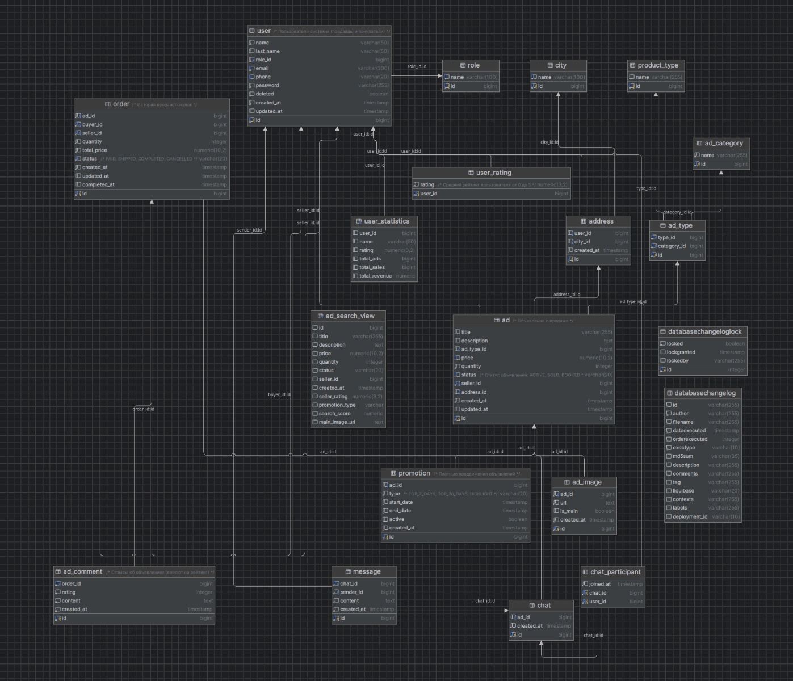

Classified – Платформа частных объявлений

RESTful API для размещения, поиска и управления частными объявлениями.
Реализовано на Java 17, Spring Boot 3.4.7, с использованием Hibernate/JPA (без Spring Data),
PostgreSQL Liquibase, Spring Security (JWT), MapStruct и Docker.

Реализованный функционал:
- Регистрация и аутентификация
  - Регистрация пользователя (USER) и администратора (ADMIN)
  - Вход по email/паролю, получение JWT токена
- Управление профилем
  - Редактирование имени, фамилии, email, телефона
  - Смена пароля с проверкой старого
  - Просмотр статистики продаж (рейтинг, количество объявлений, продаж, выручка)
- Объявления
  - Создание, редактирование, удаление
  - Поиск и фильтрация (по названию, цене, статусу, продавцу, минимальному рейтингу)
  - Сортировка (цена, дата, заголовок, рейтинг продавца)
  - Пагинация
  - Изменение статуса объявления (ACTIVE, SOLD, BOOKED)
- Система рейтингов
  - Отзывы на завершённые заказы
  - Вычисление среднего рейтинга продавца и объявления
  - Рейтинг продавца влияет на положение его объявлений в выдаче
- Продвижение объявлений (Promotions)
  - Платные пакеты: TOP_7_DAYS, TOP_30_DAYS, HIGHLIGHT
  - Промо-объявления всегда вверху выдачи
  - Возможность деактивировать промо (владельцем или админом)
- Заказы (история продаж)
  - Создание заказа (покупателем)
  - Изменение статуса заказа (PENDING → PAID → SHIPPED → COMPLETED / CANCELLED)
  - Просмотр списка покупок и продаж
- Чат между покупателем и продавцом
  - Создание чата (один на объявление и покупателя)
  - Отправка и удаление сообщений
  - Пагинация сообщений в чате

 Технологический стек

| Категория | Технология |
|-----------|------------|
| Язык | Java 17 |
| Фреймворк | Spring Boot 3.4.7 |
| Безопасность | Spring Security, JWT (io.jsonwebtoken 0.12.5) |
| ORM | JPA / Hibernate (без Spring Data) |
| База данных | PostgreSQL 15 |
| Миграции БД | Liquibase 4.26.0 |
| Маппинг DTO | MapStruct 1.5.5 |
| Документация API | Swagger / OpenAPI 2.8.10 (springdoc) |
| Логирование | SLF4J + Logback |
| Тестирование | JUnit 5, Mockito, AssertJ |
| Интеграционные тесты | H2 |
| Сборка | Maven 3.9+ |
| Контейнеризация | Docker, Docker Compose |
| Валидация | Hibernate Validator |


 Архитектура модулей

Проект состоит из 9 Maven-модулей:
```
classified/
├── common # Общие утилиты, пагинация, ErrorCode
├── domain # JPA-сущности, интерфейсы репозиториев
├── dto # Объекты передачи данных (Request/Response)
├── mapper # MapStruct-интерфейсы для конвертации Entity ↔ DTO
├── persistence # Реализации репозиториев (чистый JPA)
├── security # JWT-сервис, фильтр, UserDetailsImpl
├── service # Бизнес-логика
├── web # REST-контроллеры
└── app # Точка входа (Main), конфигурация Spring, миграции
```

Для сборки и запуска необходимы:

- **JDK 17** (например, Eclipse Temurin)
- **Maven 3.8+** (или Maven Wrapper `mvnw`)
- **Docker Desktop** (для запуска контейнеров)
- **Git** (для клонирования репозитория) **или ZIP-архив** с исходным кодом

Все остальные зависимости (PostgreSQL, Tomcat) поставляются внутри Docker-контейнеров.

## Быстрый старт

### 1. Клонирование / распаковка

Из Git:
```
git clone https://github.com/Polentrampus/classified.git
cd classified
```
### 2. Настройка переменных окружений

Отредактируйте docker-compose.yml, задав все пароли и секреты:
environment:
- SPRING_DATASOURCE_URL: ваша_ссылка
- SPRING_DATASOURCE_USERNAME: ваш_пользователь
- SPRING_DATASOURCE_PASSWORD: ваш-пароль
- JWT_SECRET: ваш_jwt_токен

Остальные параметры можно оставить без изменений.

### 3. Сборка проекта

Через Maven:
```
mvn clean package -DskipTests
```
### 4. Запуск через Docker Compose
```
docker compose up --build -d
```
Флаг -d запускает контейнеры в фоновом режиме. При первом запуске Docker скачает образы PostgreSQL и JRE.
После старта приложение будет доступно на порту 8080.

### 5. Проверка работоспособности

Откройте в браузере Swagger UI:

http://localhost:8080/swagger-ui/index.html

### 6. Остановка
```
docker compose down
```
Флаг -v удаляет все сохранённые данные БД.


### БД диаграмма:



